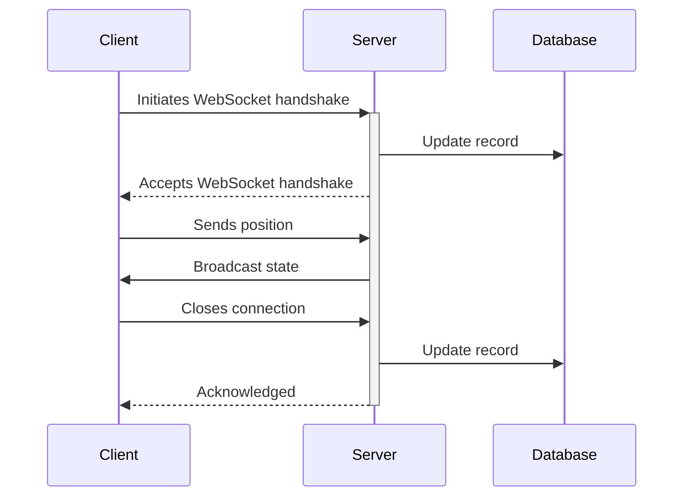
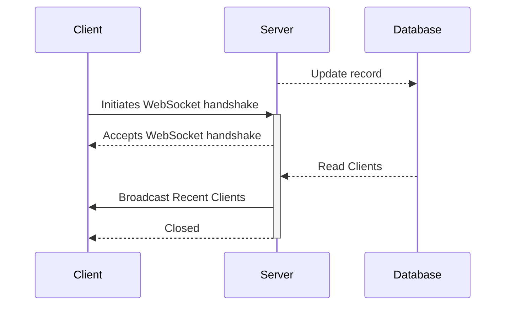

# Ghost Sockets

This project was an exploration of the use of WebSockets across both the client
and server side. The basic idea was to track cursor movements on the client side
and send them to the server side. The server would then broadcast the cursor
movements to all connected clients. The result is a ghostly cursor that follows
the movements other users make on the page.

## Getting Started

The project is split into two parts: the client and the server. The client is
built using [Vite](https://vite.dev/) and [React](https://react.dev/) and are
located in the `client` directory. The server is built using
[Golang](https://go.dev/) and is located in the `server` directory.

After cloning the repository, you will need to setup the `.env` files in the
root of the project. Run the following command to copy the example `.env` files:

```bash
cp .env.example .env
```

You can now update the `.env` files with the appropriate values

Both services, along with a [Postgres](https://www.postgresql.org/) database,
are containerized using [Docker](https://www.docker.com/). With Docker
installed, run the following:

```bash
docker compose up --build
```

This will expose three services:

1. The client, which is available at `http://localhost:${CLIENT_PORT}`
2. The server, which is available at `http://localhost:${SERVER_PORT}`
3. The Postgres database, which is available at `http://localhost:5432`

### Developing the Client

To develop the client, you can run the following command:

```bash
docker compose up database server
```

This will start the database and server services. You can then run the client in
development mode:

```bash
cd client
bun dev
```

### Developing the Server

To develop the server, you will need to rebuild the server service:

```bash
docker compose up --build server
```

## Architecture

With websockets, the client initiates a connection with the server. The server
then broadcasts messages to all connected clients. The server also maintains a
connection to a database to store records of users that have connected.



In this way its possible to build multiple http routes for various clients data
streams, for example an Active User feed which would broadcast the most recent
users and if they are currently active.


